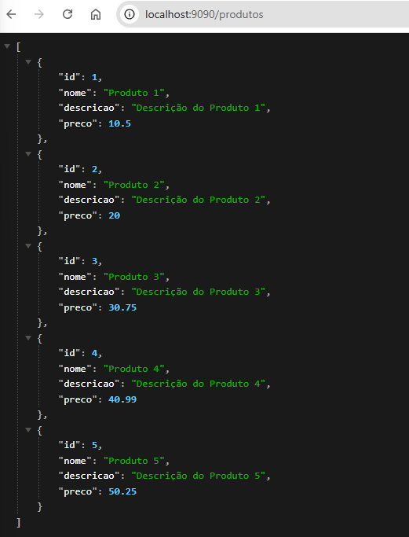

# Docker: Do zero a IA

Apresentação de ideia basica do Docker.

## Configuração
Temos um arquivo ``docker-compose.yml`` e executando o comando para subir a aplicação:
```
docker-compose up -d
```

Arquivos ``.sql`` é importado quando necessário, neste caso foi para criar uma tabela e inserir registros.

O arquivo ``init.sql`` será montado no contêiner PostgreSQL no diretório /docker-entrypoint-initdb.d/.

O PostgreSQL executa automaticamente qualquer arquivo ``.sql`` presente nesse diretório ao inicializar o banco de dados.

## Go
Servidor simples em ``Go`` para conectar em banco de dados e trazer os dados no endpoint ``localhost:9090/produtos``
